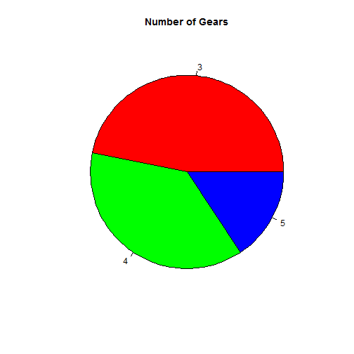

Which car should you bought on the 70's? Developing Data Products Course Project
========================================================
author: Raul Mascaro (ramascaro)
date: September 2016

Index
========================================================

1. Background/Motivation
2. Code for plots
3. Guidelines to reproduce locally
4. For more information


Background/Motivation
========================================================

During this assignment I had the idea to see which car should I bought on the 70's according my
preferences of fuel consumption, number of cylinders/gears, transmission type.

Using this searching 
options I'll get which models I could choose. 

Adding to this, I made some pie charts to render plots and use differnt tabs with Shiny.

I've used is the R built-in dataset [mtcars](https://stat.ethz.ch/R-manual/R-devel/library/datasets/html/mtcars.html).

Here, you can see my Course Project:

- [Web app](http://ramascaro.shinyapps.io/Developing_Data_Products_CP)

- [GitHub Repo](https://github.com/ramascaro/developing_data_products_course_project)


Some Code for plots / table
========================================================

Here is the code for a static view of the default plot that is rendered on the web app:

```r
data(mtcars)
pie(table(mtcars$gear), col=rainbow(3), main="Number of Gears")
```



```r
print(pie)
```

```
function (x, labels = names(x), edges = 200, radius = 0.8, clockwise = FALSE, 
    init.angle = if (clockwise) 90 else 0, density = NULL, angle = 45, 
    col = NULL, border = NULL, lty = NULL, main = NULL, ...) 
{
    if (!is.numeric(x) || any(is.na(x) | x < 0)) 
        stop("'x' values must be positive.")
    if (is.null(labels)) 
        labels <- as.character(seq_along(x))
    else labels <- as.graphicsAnnot(labels)
    x <- c(0, cumsum(x)/sum(x))
    dx <- diff(x)
    nx <- length(dx)
    plot.new()
    pin <- par("pin")
    xlim <- ylim <- c(-1, 1)
    if (pin[1L] > pin[2L]) 
        xlim <- (pin[1L]/pin[2L]) * xlim
    else ylim <- (pin[2L]/pin[1L]) * ylim
    dev.hold()
    on.exit(dev.flush())
    plot.window(xlim, ylim, "", asp = 1)
    if (is.null(col)) 
        col <- if (is.null(density)) 
            c("white", "lightblue", "mistyrose", "lightcyan", 
                "lavender", "cornsilk")
        else par("fg")
    if (!is.null(col)) 
        col <- rep_len(col, nx)
    if (!is.null(border)) 
        border <- rep_len(border, nx)
    if (!is.null(lty)) 
        lty <- rep_len(lty, nx)
    angle <- rep(angle, nx)
    if (!is.null(density)) 
        density <- rep_len(density, nx)
    twopi <- if (clockwise) 
        -2 * pi
    else 2 * pi
    t2xy <- function(t) {
        t2p <- twopi * t + init.angle * pi/180
        list(x = radius * cos(t2p), y = radius * sin(t2p))
    }
    for (i in 1L:nx) {
        n <- max(2, floor(edges * dx[i]))
        P <- t2xy(seq.int(x[i], x[i + 1], length.out = n))
        polygon(c(P$x, 0), c(P$y, 0), density = density[i], angle = angle[i], 
            border = border[i], col = col[i], lty = lty[i])
        P <- t2xy(mean(x[i + 0:1]))
        lab <- as.character(labels[i])
        if (!is.na(lab) && nzchar(lab)) {
            lines(c(1, 1.05) * P$x, c(1, 1.05) * P$y)
            text(1.1 * P$x, 1.1 * P$y, labels[i], xpd = TRUE, 
                adj = ifelse(P$x < 0, 1, 0), ...)
        }
    }
    title(main = main, ...)
    invisible(NULL)
}
<bytecode: 0x0000000013f3a530>
<environment: namespace:graphics>
```

 
Guidelines to reproduce locally
========================================================

Guidelines to reproduce this project locally on your PC

To run locally this App on your computer you do NOT need to fork this repo. Please follow these instructions:

1. Install the necessary packages to run RStudio's Shiny Server locally. Please view the well documented requirements in the getting started page: http://shiny.rstudio.com/articles/shinyapps.html

2. You can clone or download the app from [GitHub] (https://github.com/ramascaro/developing_data_products_course_project).

3. Run files inside "shiny" folder.


========================================================

Thank you! 

I hope you enjoy this task!


